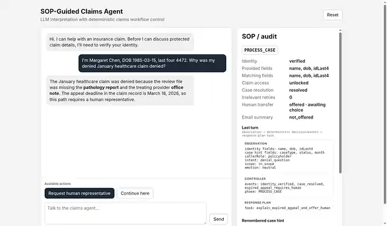

# SOP-Guided Claims Agent

An LLM interprets caller language. Deterministic code owns identity verification, phase transitions, claim selection, applicability, consent, and protected actions. Code produces a bounded, grounded response plan, and the LLM phrases that plan for the caller.

```text
VERIFY_ID -> RESOLVE_INTENT -> PROCESS_CASE -> POST_PROCESS
```

```text
caller language
  -> LLM observation
  -> deterministic controller + events
  -> bounded grounded response plan
  -> LLM phrasing
```



## Run it

Node 22+ is enough; the app has no runtime package dependencies.

The tested configuration is **OpenCode Go + Muse Spark 1.3 Contributor**:

```bash
export MODEL_API_KEY='YOUR_OPENCODE_GO_KEY'
export MODEL_BASE_URL='https://opencode.ai/zen/go/v1'
export MODEL_ID='muse-spark-1.3-contributor'
export MODEL_REASONING_EFFORT='low'
npm start
```

Open `http://localhost:3000`.

The application keeps provider-neutral configuration names:

- `MODEL_API_KEY`
- `MODEL_BASE_URL`
- `MODEL_ID`
- `MODEL_REASONING_EFFORT`

`.env.example` contains the same known-good settings. You can also run:

```bash
cp .env.example .env
# Add MODEL_API_KEY to .env
node --env-file=.env src/server.js
```

### Docker

Docker is a supported delivery path:

```bash
cp .env.example .env
# Add MODEL_API_KEY to .env
docker build -t stunning-bassoon .
docker run --rm -p 3000:3000 --env-file .env stunning-bassoon
```

## Three demo conversations

Use **Reset** between conversations. Paste each line as one caller turn.

### 1. Goaly's supplied Margaret test case

```text
I'm the policyholder. My name is Margaret Chen, policy POL-9921. I'm calling about my denied healthcare claim from January. DOB is 1985-03-15, SSN last four is 4472.
```

This is the assignment's test utterance verbatim. It should verify the caller, retain the denied-healthcare-January hint, resolve CL-2048 without asking which claim from scratch, and proceed using the resolved caller goal. The **Last turn** inspector shows the observation field names and semantics, controller event types/resulting phase, and response-plan task.

### 2. Terse verification, then choose a claim and intent

```text
I'm Margaret Chen, DOB 1985-03-15.
4472
My auto claim from February.
What's its status?
```

This demonstrates bounded dialogue context, deterministic verification, a resolved claim target waiting for an actionable intent, and then `PROCESS_CASE`.

### 3. Finish the case and make an explicit post-process choice

Start with conversation 2, then continue:

```text
Okay, that's all I needed.
skip email
```

This moves to `POST_PROCESS` and records the explicit email-summary choice in code.

## What to look at

The browser intentionally stays simple: chat on the left, live SOP/audit state on the right. The **Last turn** inspector makes the core model/controller seam visible as:

```text
observation -> deterministic decision/events -> response-plan task
```

The inspector exposes safe debug semantics only: supplied identity/case field names, semantic classifications, controller event types, resulting phase, and the response-plan task. Pre-verification match correctness, hidden policyholder records, provider payloads, secrets, and protected claim details stay outside that inspector.

The main implementation path is small and direct:

- `src/model.js` — strict-schema language observation and response phrasing;
- `src/agent.js` — turn orchestration across model and deterministic code;
- `src/controller.js` — verification, phase transitions, claim selection, consent, and handoff state;
- `src/response-plan.js` — bounded task and grounded facts the phrasing model may use;
- `src/observation-context.js` — bounded conversational context for terse follow-ups.

## Tests and evals

Ordinary CI is deterministic and makes no paid model calls. It runs:

```bash
npm test
npm run eval
node --check eval/live.js
node --check eval/list-live-scenarios.js
node --check eval/aggregate-live.js
docker build -t stunning-bassoon .
```

CI also starts the built Docker image, verifies `/`, and initializes `/api/session` with placeholder model configuration that cannot make a paid provider call.

`npm test` covers the controller, model boundary, dialogue context, selected-claim grounding, authorization guards, consent, server behavior, and the safe inspector surface. `npm run eval` prints deterministic transition timelines for normal and adversarial scenarios.

The paid live-model suite remains opt-in and outside ordinary CI. Provider contract details, privacy notes, compatibility evidence, and live-eval mechanics live in [`docs/provider-and-live-eval.md`](docs/provider-and-live-eval.md).

## Safety boundary

Claim data stays gated until at least three distinct PII fields verify the policyholder. Representative callers route to a human path because the fixture set defines relationship data without a representative-authorization procedure. Email delivery is simulated as a preview and requires an explicit send choice.

This submission is repo/Docker-first. A hosted deployment, shared session persistence, public access control, and rate limiting are separate deployment decisions.
